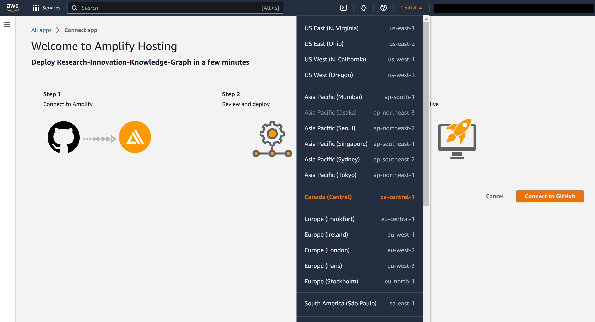
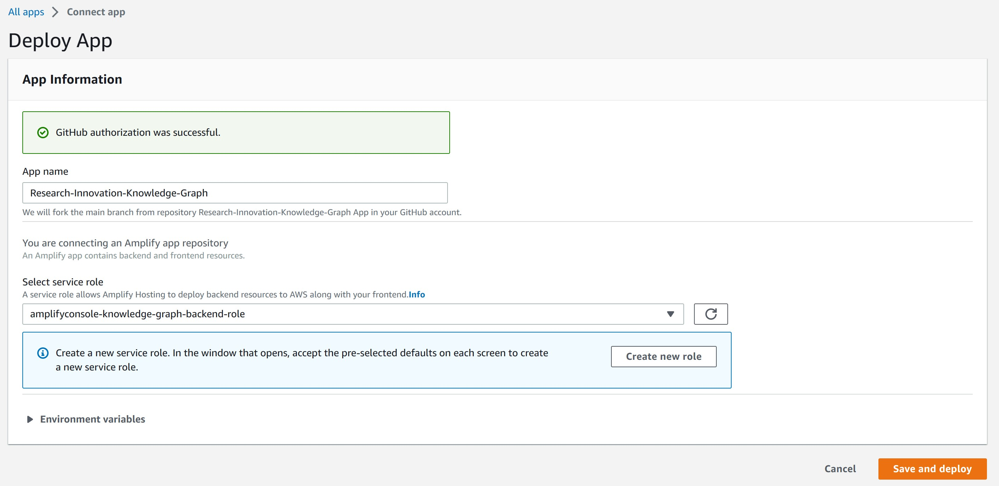
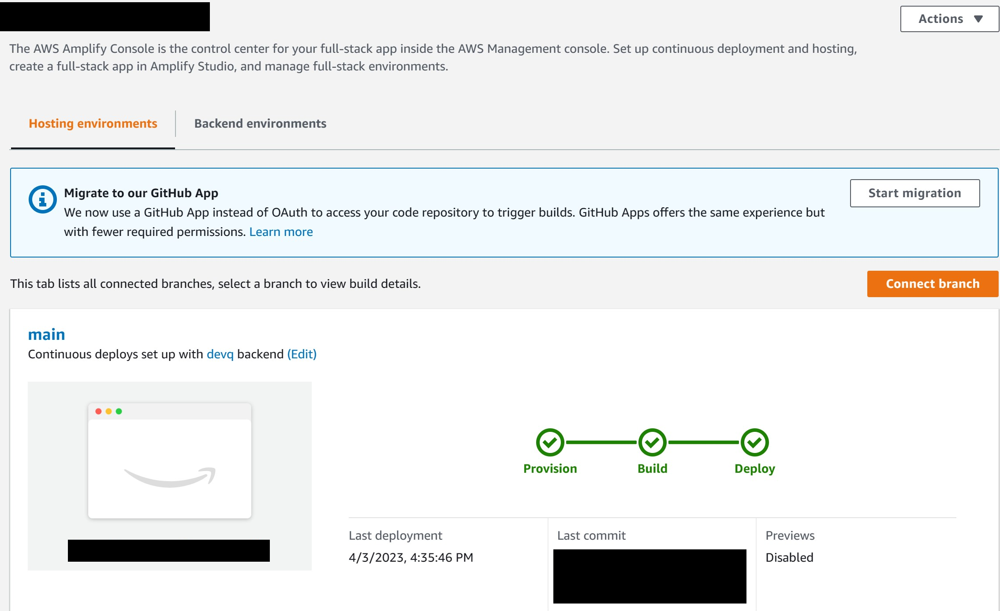
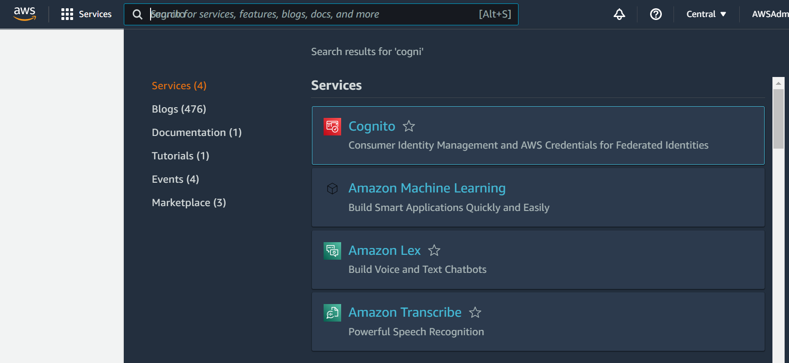
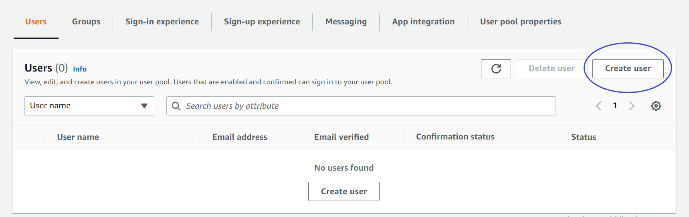
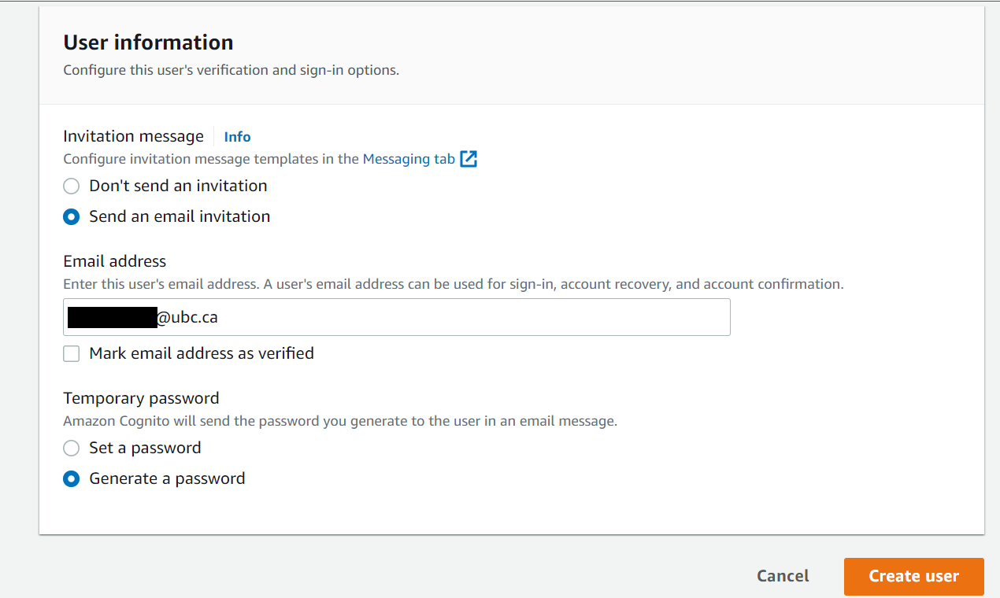
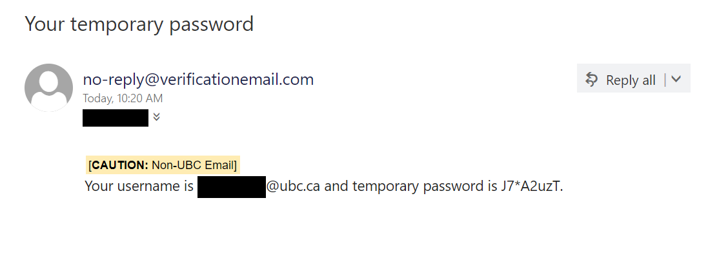
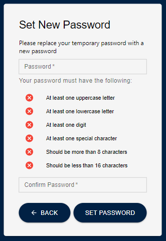

# Step 1: Frontend Deployment

Before installing Amplify we need to create the IAM Role that gives us the permissions needed to implement this solution. Run the following line of code:

```bash
aws cloudformation deploy --template-file cfn-amplifyRole.yaml --stack-name amplifyconsole-knowledge-graph-backend-role --capabilities CAPABILITY_NAMED_IAM
```

If you have multiple AWS Profiles, specify one with sufficient admin permissions by appending the following text to the end of the command, replacing the profile name with the profile you would like to use for the solution (If you do this, be sure to include the same `--profile` argument for the rest of the commands starting with `aws`. The profile you are using for this project should have administrator privliges).

```bash
--profile [PROFILE NAME]
```

This step creates the IAM role called **amplifyconsole-knowledge-graph-backend-role** that will be used on the next step.

The **Deploy to Amplify Console** button will take you to your AWS console to deploy the front-end solution.

<a href="https://console.aws.amazon.com/amplify/home#/deploy?repo=https://github.com/UBC-CIC/Research-Innovation-Knowledge-Graph">
    
</a>

1. On the AWS console. select your region on the top right, then connect to GitHub.
   
2. Select the **amplifyconsole-knowledge-graph-backend-role** we made previously for the deployment role, and then press `Save and Deploy`
3. The deployment will take a few minutes. Wait until the status shows **Deploy** in green

# Step 2: Backend Deployment

It's time to set up everything that goes on behind the scenes! For more information on how the backend works, feel free to refer to the Architecture Deep Dive, but an understanding of the backend is not necessary for deployment.

## Step 1: Install Dependencies

The first step is to get into the backend folder. This can be done with the following commands:

```bash
cd back_end
cd cdk
```

Now that you are in the backend directory, install the core dependencies with the following command:

```bash
npm install
```

## Step 2: Database Username

You  have to supply a custom database username when deploying the solution to increase security. Run the following command and ensure you replace `DB-USERNAME` with the custom name of your choice.

```
aws secretsmanager create-secret \
    --name knowledgeGraph-dbUsername \
    --description "Custom username for PostgreSQL database" \
    --secret-string "{\"username\":\"DB-USERNAME\"}"
```

For example: you want to set the database username as "knowledgeGraph"

```
aws secretsmanager create-secret \
    --name knowledgeGraph-dbUsername \
    --description "Custom username for PostgreSQL database" \
    --secret-string "{\"username\":\"knowledgeGraph\"}"
```

## Step 3: CDK Deployment

Initialize the CDK stacks (required only if you have not deployed this stack before). Note the CDK deployment assumes you are deploying in ca-central-1

```bash
cdk synth --profile your-profile-name
cdk bootstrap aws://YOUR_AWS_ACCOUNT_ID/ca-central-1 --profile your-profile-name
```

Deploy the CDK stacks (this will take 30-45 minutes):

If you run into any issues while deploying, refer to [Troubleshooting](#troubleshooting) for solutions.

You must also deploy the stacks individually (it is important to deploy the stack listed in the order below):

```
cdk deploy KnowledgeGraphVpcStack  --profile your-profile-name
```

```
cdk deploy KnowledgeGraphDatabaseStack  --profile your-profile-name
```

```
cdk deploy KnowledgeGraphAppsyncStack --profile your-profile-name
```

```
cdk deploy KnowledgeGraphGlueStack --profile your-profile-name
```


# Step 7: Creating a User

To set up user accounts on the app, you will need to do the following steps

1. At the [AWS online console](https://console.aws.amazon.com/console/home), enter `Cognito` in the search bar.
   
2. Click `User Pools` from the left hand sidebar and select the user pool that was created.
   
3. Click the `Users` tab, then click `Create User`.
   
4. For Invitation message, select `Send an email invitation`. Then fill in the user's email address in the Email address text field below. For Temporary password, select `Generate a password`. THen click `Create User`.
   
5. The user will receive an email to the email address that was previously entered containing their temporary password.
   
6. When the user enters their email and temporary password on the sign in page of the app, they will then be prompted to replace their temporary password by setting a new password.
   <br>
   
7. The new user account has been created!
