# User Guide

**Before Continuing with this User Guide, please make sure you have deployed the frontend and backend stacks.**

- [Deployment Guides](./DeploymentGuide.md)

| Index                                                      | Description                                           |
| :--------------------------------------------------------- | :---------------------------------------------------- |
| [Home](#Home)                                              | Home Page                                             |
| [Main Graph](#Main-Graph)                                  | Main graph (Displays all Researchers)                 |
| [Researchers Search](#Researcher-Search)                   | Researcher search bar (By name)                       |
| [Researcher Node Selection](#Researcher-Node-Selection)    | Researcher profile and information page               |
| [Side Panel](#Side-Panel)                                  | Additional information about the graph                |
| [Filters](#Filters)                                        | Filters for the graph                                 |
| [Updating Researchers](#Updating-Researchers)              | Process for Updating Researcher Data                  |

**Note:** The screenshots contained in this User Guide show some information as redacted to obscure data that is not fully up to date.
 

## Home

The Home page displays the main view of the website and all components. This includes the [Main Graph Component](#main-graph), [Searchbar Component](#researcher-search), [Filters](#Filters), and the [Side Panel](#Side-Panel).

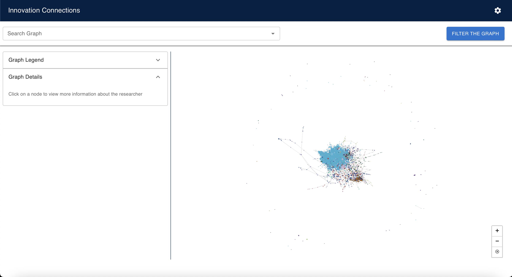

#### NOTE: "Innovation Connections" logo in this document may be replaced with the logo of the institution that will deploy this solution. 

## Main Graph

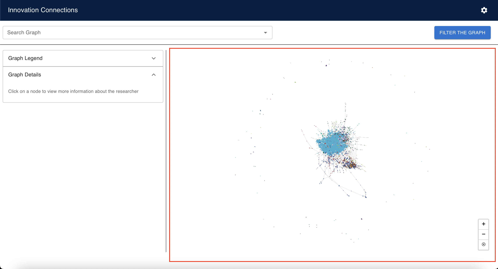

The main graph displays all the researchers in the graph, where each researcher is represented as a node and an edge is the connection between two researchers. A connection between two researchers means that they have co-authored a research paper together. 

The size of a node represents how well-connected a researcher is, the more connections the larger the node. 

The thickness of an edge represents how strong the connection is between researchers, which is determined by how many papers the they have co-authored.

Hovering over a node in the graph displays the researchers name and greys out the rest of the graph *except* for their direct connections

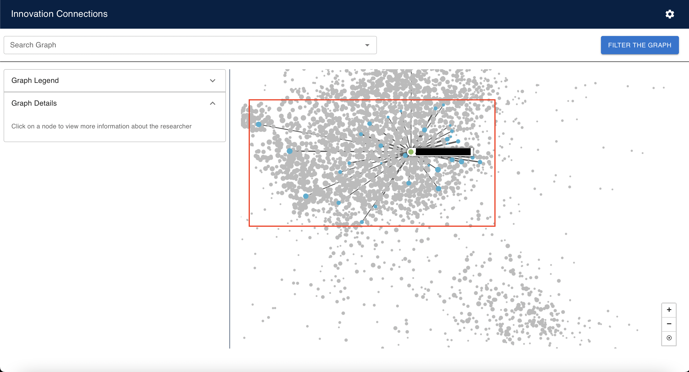

The color of each node represents which faculty they are in. Opening the [Graph Legend](#Graph-Legend) on the [Side Panel](#Side-Panel) will display which color represents which faculty. The thickness of the edge represents how well connected two researchers are, and this metric is determined by the number of papers the researchers share. 

At the bottom right of the main graph are 3 view options. The `+` and `-` allows the user to zoom in and out of the graph respectively. These can also be controlled by using the scroll wheel to zoom in and out. The last option returns the graph to the default zoom level and centers the graph. 

## Researcher Search

The search bar allows the user to search for a specific researcher by their name. As you type into the search bar, a dropdown list of suggested researchers that match the current string appears. Clicking on a name zooms into the selected researcher ([Researcher Node Selection Mode](#Researcher-Node-Selection)).

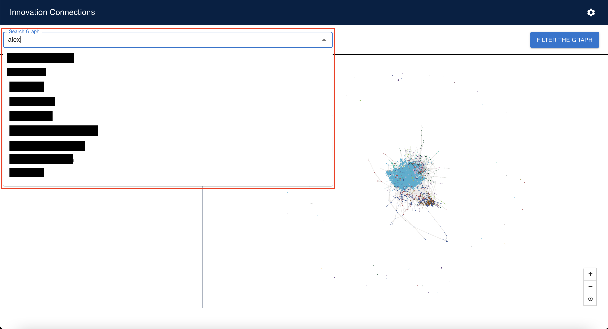

## Researcher Node Selection

When a node is clicked on the graph it zooms into the selected researcher and defaults to showing their direct connections (higher level depth connections can be controlled by the [Levels of Connections](#levels-of-connections) toggle). Information is filled about the researcher under the [Graph Detail](#graph-details) and [Similar Researchers](#similar-researchers) sections of the [Side Panel](#side-panel). 

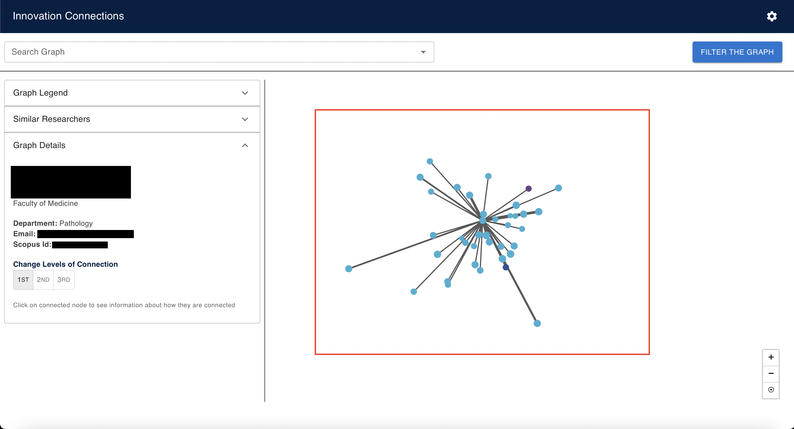

Clicking on another researcher in this mode hides the other direct connections and updates the [Graph Details](#graph-details) to display a list of papers the two researchers share together. This list contains links to Scopus of the research papers they have wrote.

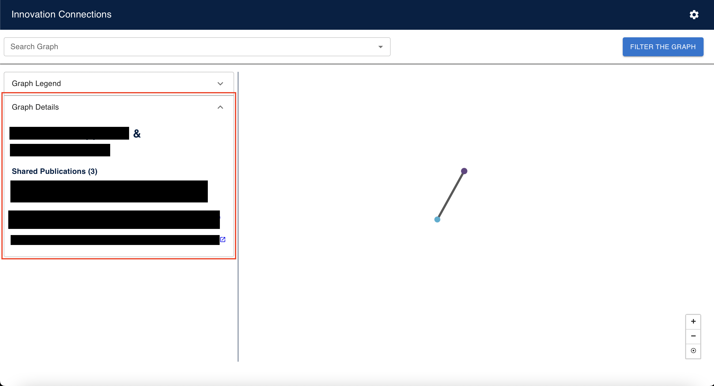

To exit this mode and display the full graph again, the user must click anywhere outside the graph. 

## Side Panel

The side panel is broken into two parts, the [Graph Legend](#graph-legend) and the [Graph Details](#graph-details). When a researcher is selected, the side panel will display another dropdown called [Similar Researchers](#similar-researchers).

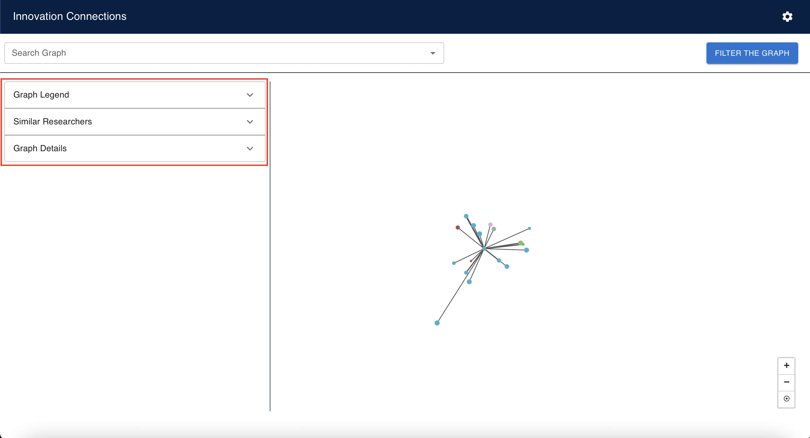

### Graph Legend 

The graph legend displays which faculty is represented by its respective color in a list. By selecting specific faculty filters from the [Filters](#filters), the graph legend will display which faculty filters are currently applied. 

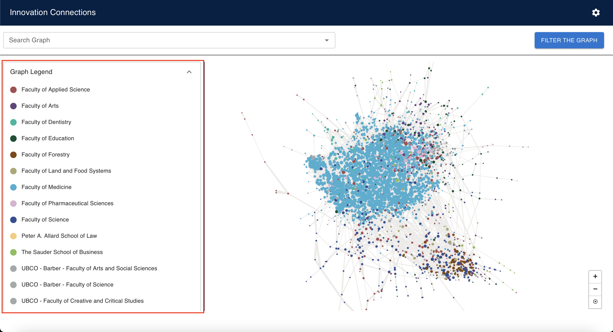

### Graph Details 

The graph details section is filled once a researcher node is selected. This shows specific details of the currently selected researcher as well as the option to show different levels of connections. 

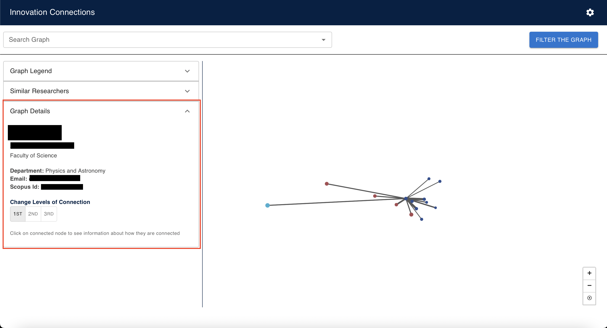

#### Levels of Connections

This part of the graph details allows the user to control the level of connections of the currently selected researcher. This means the user can see mutual researcher connections that are 2 or 3 edges away and the [selected researcher graph](#researcher-node-selection) will be updated as such.  

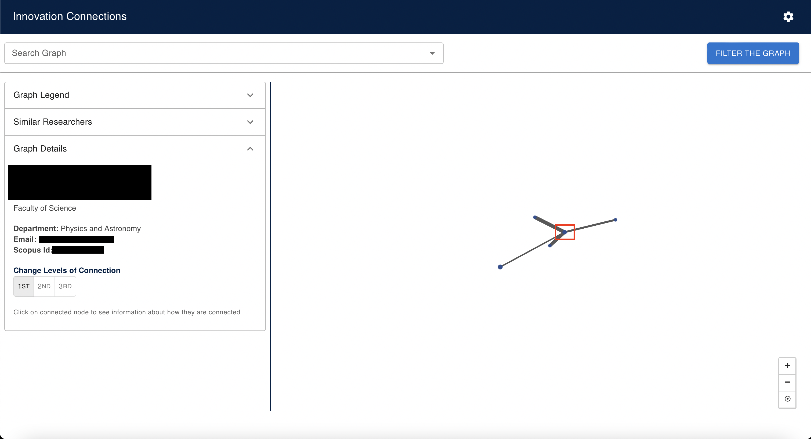*Level 1 (Direct) Connections*

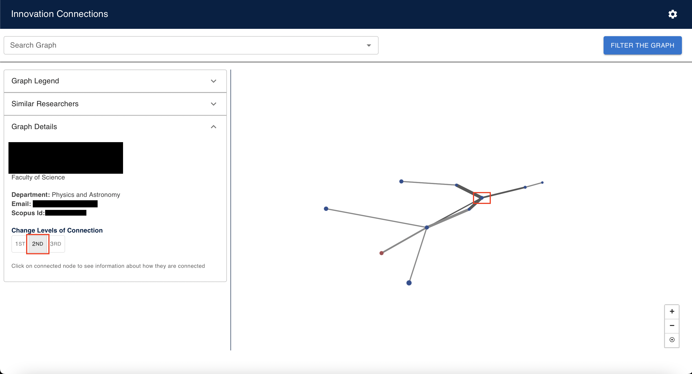*Level 2 Connections*

### Similar Researchers

The similar researchers section appears once a researcher node is selected. This shows researchers that share similar keywords/research topics with the currently selected researcher, ordered from most to least shared keywords/topics, and is limited to the top 5 most similar researchers. The information of each similar researcher consists of their name, faculty and list of shared keywords/topics. 

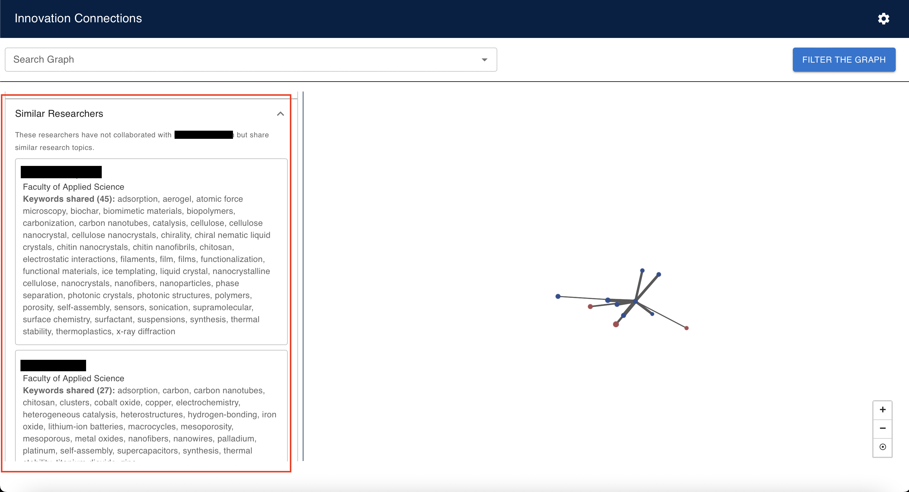

## Filters

The filters allow the user to select which faculties and keywords to filter the graph by. By clicking the button `Filter the Graph` at the top right, a modal will pop up with all the filter options. Faculty filters are selected by clicking the box next to the filter. Keyword filters are entered in the text field and **must** be comma separated. The keyword filtering is case **insensitive**. The keyword filtering works by finding researchers that match all the keywords that are entered (Eg. by entering `genetics, covid` the graph will be filtered by researchers that have the keywords `genetics` **AND** `covid`). To apply the filters, click the `Apply Filters` button at the bottom of modal. 

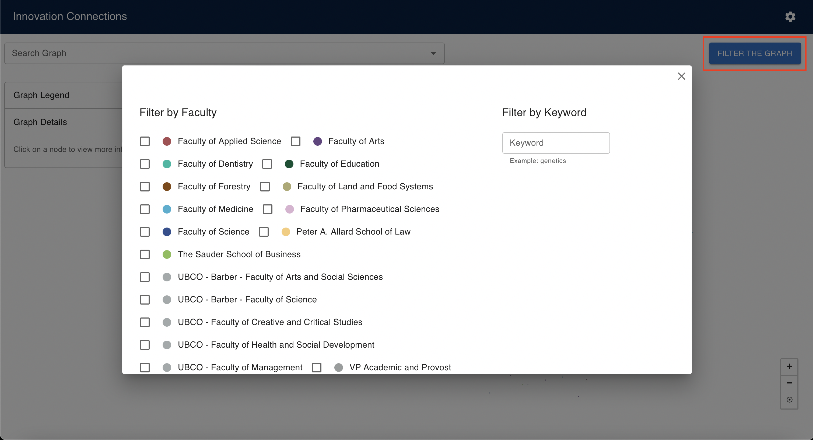

## Website Tour 

The website tour first appears when the user logs into the website or can be started again by pressing the [Start Tour](#start-tour--update-this-when-actually-updated-on-frontend) button. This gives the user a step-by-step rundown of the functionalities of the website. The user may also skip this by clicking on `Skip` at any point of the tour. 

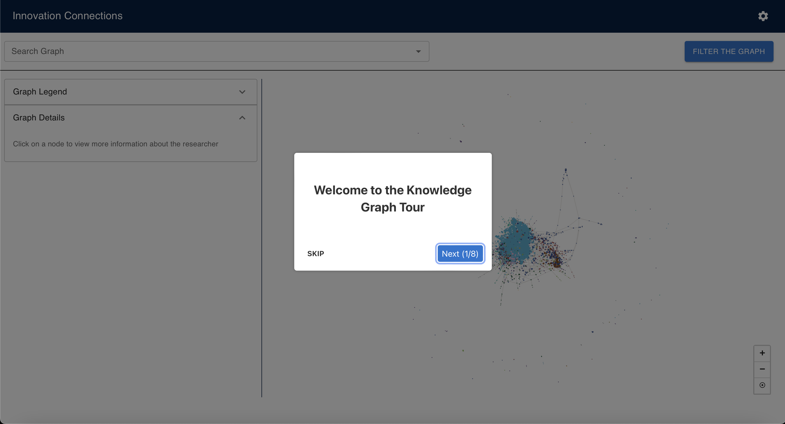

## Options 

### Start Tour (?) update this when actually updated on frontend

Allows the user to restart the website tour

### Logout 

Logs the user out of the app
